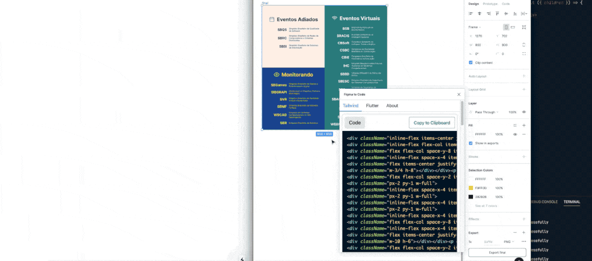
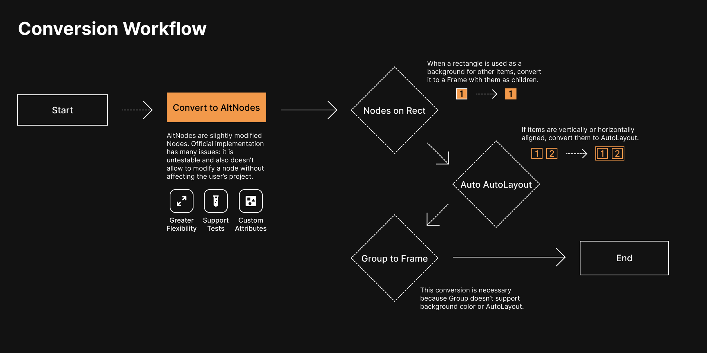
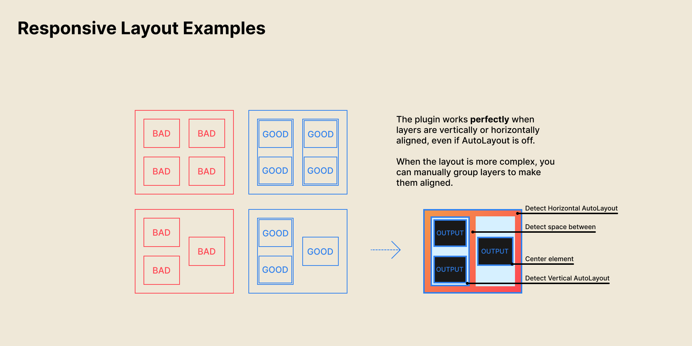

Figma to Code
===========

Most *design to code* plugins are bad. This project aims to solve, or at least improve, the situation. This plugin generates responsive layouts in [Tailwind](https://tailwindcss.com/) and [Flutter](https://flutter.github.io/). The plan is to eventually add support for [Jetpack Compose](https://developer.android.com/jetpack/compose) and possibly standard HTML or other frameworks like [SwiftUI](https://developer.apple.com/xcode/swiftui/), [Bootstrap](https://getbootstrap.com/), [Material](https://material.io/develop/web/), [Fluent](https://www.microsoft.com/design/fluent/), etc. Feedback and partnerships are appreciated!

### How it works

This plugin takes an unconventional approach to improve code quality: it optimizes the layout before the conversion to code even begins. The standard Figma [Nodes](https://www.figma.com/plugin-docs/api/nodes/) (what represents each layer) was a joy to work with, but it can't modify a layer without modifying the user project. For this reason, I decided to virtualize it, remaking the official implementation and naming it `AltNodes`. During the process to convert a `Node` into an `AltNode`, the plugin does the following:

### Hard cases
When finding the unknown (a `Group` or `Frame` with more than one child and no vertical or horizontal alignment), Tailwind mode uses [insets](https://tailwindcss.com/docs/top-right-bottom-left/#app) for best cases and `left`, `top` from standard CSS for the worst cases. Flutter mode uses `Stack` and `Positioned.fill`. Both are usually not recommended and can easily defeat the responsiveness. In many scenarios, just wrapping some elements in a `Group` or `Frame` can solve:

### Things it still can't do

- Vector (tricky in HTML, unsupported in Flutter)
- Images (they are local, how to support?)
- Gradients (unsupported by Tailwind, todo in Flutter)
- Line/Star/Polygon (todo. Rectangle and Ellipse were prioritized and are more common)
- Identify buttons
- The source code is fully commented and there are about 30 "todo"s spread

#### Tailwind limits

- **Width:** Tailwind has a maximum width of 256px. If an item passes this, the width will be set to `w-full` (unless it is `w-1/2`, `w-1/3`, etc because of the parent). This is usually a feature, but be careful: if everything in your project is huge, the plugin's result might be less than optimal.
- **Height:** The plugin avoids setting the height whatever possible, because width and height work differently in CSS. `h-full` means get the full height of the parent, but the parent **must** have it, while `w-full` doesn't require it to have. During experiments, avoid a fixed height, in most cases, brought benefits in improved responsiveness.

#### Flutter limits

- **Align:** currently items are aligned inside a Row/Column according to their average position. Todo: find a way to improve this.
- **Unreadable code:** code is not formatted, but even [dartpad](https://dartpad.dev/) offers a format button.
- **Stack:** in some cases, a `Stack` could be replaced with `Container` and `BoxDecoration`. Find these cases and optimize them.
- **Material Styles**: possible optimization, find if current text size, color, and weight match any material text style.
- **Identify FlatButtons**: instead of outputting `Container` or `Material`, it could identify specific buttons and help the user.

#### Webpack vs Rollup
The project is configured to be built with Webpack or Rollup. The author couldn't find how to correctly configure Svelte in Webpack, so Rollup was added. But Rollup is a lot buggier than Webpack and crashes regularly in watch mode for Typescript files. So, if you are going to edit only Typescript, I reccommend sticking with Webpack. If you are going to make changes in the UI, you **need** to use Rollup for now.

#### Architecture
There is, unfortunately, not a defined architecture pattern in the project. Builders are used, but the result was worse than expected. Ideally, I thought it would help to have a group of interfaces (position, size, opacity, and so on), where each language/framework could implement it, but there were too many changes. For example, Tailwind appends attributes to a string, while Flutter replaces the string as attributes get nested. If you have ideas or would like to discuss further, feel free to contact me.

Issue Tracking
-------
Found a bug? Have an idea for an improvement? Feel free to [add an issue](../../issues). Pull requests are also more than welcome.
